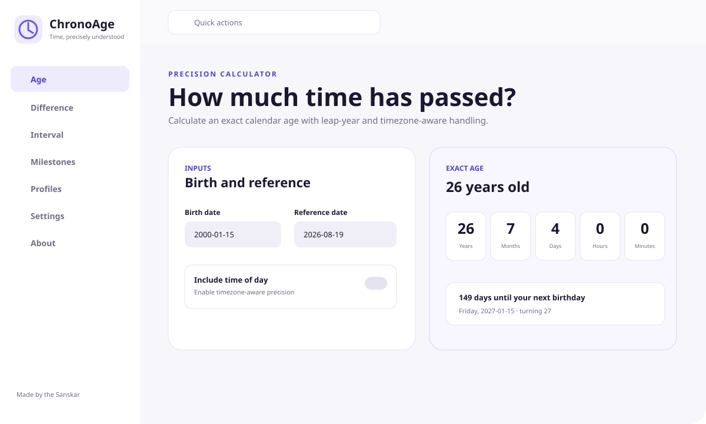

<div align="center">
  
  <h1>ChronoAge</h1>
  <p><strong>A privacy-first, timezone-aware age and date calculator that works beautifully on the web and offline.</strong></p>
  <p><strong>Made by the Sanskar</strong></p>

  [](CHANGELOG.md)
  [](https://github.com/sanskarIN/chronoage/actions/workflows/ci.yml)
  [](https://github.com/sanskarIN/chronoage/actions/workflows/codeql.yml)
  [](LICENSE)
  [](https://buymeacoffee.com/sanskarIN)
</div>

## Why ChronoAge

ChronoAge goes beyond a basic age calculator. It combines calendar-accurate age math, next-birthday planning, interval tools, custom milestone discovery, visual date comparison, local saved profiles, accessibility, offline PWA support, printable/shareable results, explicit leap-day behavior, and explicit daylight-saving overlap handling in one maintainable React + TypeScript application.

**Privacy is the default:** calculations run locally in the browser, saved profiles use local browser storage, no account is required, and the project ships with no analytics, crash-reporting backend, or cloud sync.

**Current source version:** `2.0.12`. See the [2.0.12 release notes](docs/releases/2.0.12.md) and [release guide](docs/release.md). The source version does not by itself imply that the `v2.0.12` GitHub tag/release artifact has been published; release tagging remains evidence-gated.

## Interface preview



> This repository preview is a source-controlled representation of the production UI. CI also captures desktop and mobile release-candidate screenshots during browser tests.

## Features

- Exact age in years, months, days, hours, and minutes.
- Total elapsed days, hours, and minutes.
- IANA-timezone-aware calculations when time of day is enabled.
- Rejection of nonexistent spring-forward wall-clock times.
- User-selectable earlier/later occurrence for repeated fall-back local times.
- Next-birthday date, weekday, days remaining, and age turning.
- Configurable February 29 anniversary behavior (`February 28` or `March 1`).
- Absolute age difference between any two dates with an accessible duration visualization.
- Inclusive and exclusive date interval calculator.
- 1,000/5,000/10,000+ day milestones and major birthday anniversaries.
- Custom positive-whole-number milestones in days or birthday years.
- Local-only saved profiles with validation, search, deterministic sorting, editing, one-step delete undo, progressive rendering, calculator handoff, export, import-replacement confirmation, and deletion controls.
- Saved-profile import/restore validation rejects malformed timestamps and impossible update-before-creation histories.
- Privacy-safe page deep links such as `#/profiles` plus browser Back/Forward navigation; calculator dates, times, profile names, and saved birth dates are not serialized into route URLs.
- SPA page navigation updates the document title and moves focus into main content for keyboard and assistive-technology users.
- Print/share result cards that omit private profile names by default.
- Light, dark, and system themes; reduced-motion and high-contrast settings.
- Keyboard-first navigation, visible focus states, semantic labels, and quick actions (`Ctrl/Cmd + K`).
- Installable offline PWA with user-controlled update application.
- Responsive layouts for phones, tablets, and desktops.
- Browser-level accessibility regression checks and release-candidate screenshot capture.
- Local crash-recovery UI with privacy-safe structured diagnostics.
- Automated production JavaScript/CSS gzip budget enforcement.
- Internationalization-ready string organization (English ships first).

## Supported platforms

| Platform | Delivery | Status |
| --- | --- | --- |
| Modern desktop browsers | Web | Primary |
| Android / iOS browsers | Responsive web | Primary |
| Installable PWA | Browser install | Primary |
| Windows | PWA install | Supported |
| macOS | PWA/browser | Supported |
| Linux | PWA/browser | Supported |
| Tauri desktop wrapper | Native wrapper | Deferred pending a native-only requirement |

See [docs/desktop.md](docs/desktop.md) for desktop installation, signing, packaging, and update strategy.

## Tech stack

- React 19 + TypeScript
- Vite
- Native `Intl.DateTimeFormat` + Gregorian calendar domain logic
- Browser `localStorage` for optional profiles/settings
- Native Service Worker + Web App Manifest
- Dependency-free hash/history page routing
- Vitest + Testing Library
- Playwright end-to-end, accessibility-regression, and screenshot tests
- ESLint + Prettier
- GitHub Actions + CodeQL + Dependabot

No date library is required by the runtime domain layer. Timezone conversion uses the browser's IANA timezone database through `Intl`, round-trip validation for nonexistent local times, and explicit candidate selection for repeated local times. See [docs/date-semantics.md](docs/date-semantics.md).

## Quick start

Requirements: Node.js 22.13+ and npm. The repository's reproducible development/CI runtime pin is Node.js `22.13.0` in `.nvmrc`.

```bash
git clone https://github.com/sanskarIN/chronoage.git
cd chronoage
npm install
npm run dev
```

Open `http://localhost:5173`.

Core pages can also be opened with public page-only fragments such as `http://localhost:5173/#/milestones`. ChronoAge deliberately does not put personal calculation values into those fragments.

## Quality commands

```bash
npm run format:check
npm run lint
npm run typecheck
npm test
npm run build
npm run performance:check
npm run test:e2e
```

Run the combined non-E2E quality suite with:

```bash
npm run check
```

`npm run performance:check` measures the built first-party JavaScript and CSS gzip totals against the release budgets, so run `npm run build` first when invoking it directly. `npm run metadata:check`, which is included in `npm run check`, also verifies that the `.nvmrc`, package engine floor, and permanent CI/release Node pins remain aligned.

See [docs/testing.md](docs/testing.md) for the full strategy and CI expectations.

## Build and release

```bash
npm install
npm run check
npm run build
npm run release:check -- v2.0.12
```

The production web bundle is created in `dist/`. GitHub Actions also verifies builds, runtime/security invariants, bundle budgets, and browser journeys and can publish versioned release artifacts. The `v2.0.12` tag should be created only after the evidence-gated release checklist is satisfied; see [docs/release.md](docs/release.md).

## Architecture

ChronoAge is a modular client-side application:

- `src/domain/` — deterministic date math, milestones, validation.
- `src/storage/` — versioned local persistence and backup/restore.
- `src/pages/` — feature-oriented UI pages.
- `src/components/` — reusable UI building blocks, visualizations, and the application crash boundary.
- `src/hooks/` — browser/application state integration, including the PWA lifecycle.
- `src/i18n/` — externalized English UI/recovery copy and interpolation helpers.
- `src/config/` — locale-independent project identity/runtime metadata.
- `src/utils/` — privacy-safe navigation, profile sorting, logging, PWA registration, sharing, and defaults.
- `tests/` — unit, property, integration, component, and E2E coverage.

Business rules do not depend on React. See [docs/architecture.md](docs/architecture.md), [docs/internationalization.md](docs/internationalization.md), and [docs/adr/](docs/adr/).

## Security and privacy

ChronoAge has no backend, authentication, payments, analytics, or required network API. User-entered profile data remains in local browser storage unless the user explicitly exports it. Export files are plain JSON and are **not encrypted**. Importing a backup over an existing profile collection requires confirmation before replacement.

Page URLs contain only public page identifiers. ChronoAge does not intentionally serialize calculator dates/times, profile names, saved birth dates, or other calculation inputs into its page-routing fragments.

Expected validation/product errors use curated user-visible messages. Unexpected implementation exceptions use generic UI fallbacks, and runtime diagnostics stay in the local browser console through a redacting structured logger rather than being uploaded.

- Security policy: [SECURITY.md](SECURITY.md)
- Privacy behavior: [PRIVACY.md](PRIVACY.md)
- Responsible disclosure: `sanskarin@outlook.in`
- Support: `supportramsandesh@gmail.com`

## Accessibility

The UI targets WCAG-oriented practices: keyboard operation, skip links, focus visibility, semantic labels, non-color-only status, reduced-motion support, scalable layouts, screen-reader-friendly status regions, route-change title/focus updates, and browser regression checks for common accessibility failures. See [docs/accessibility.md](docs/accessibility.md).

## Contributing

Contributions are welcome. Read [CONTRIBUTING.md](CONTRIBUTING.md), follow the [Code of Conduct](CODE_OF_CONDUCT.md), and include tests for behavior changes.

## Support and contact

- Business: [sanskarin@outlook.in](mailto:sanskarin@outlook.in)
- Business: [sanskarin.business@gmail.com](mailto:sanskarin.business@gmail.com)
- Support: [supportramsandesh@gmail.com](mailto:supportramsandesh@gmail.com)
- GitHub: https://github.com/sanskarIN
- Repository: https://github.com/sanskarIN/chronoage

## Support open-source development

[](https://buymeacoffee.com/sanskarIN)

Donations are optional and never unlock product functionality.

## License

ChronoAge is released under the [MIT License](LICENSE).

---

**Made by the Sanskar** · Open source · Privacy first
